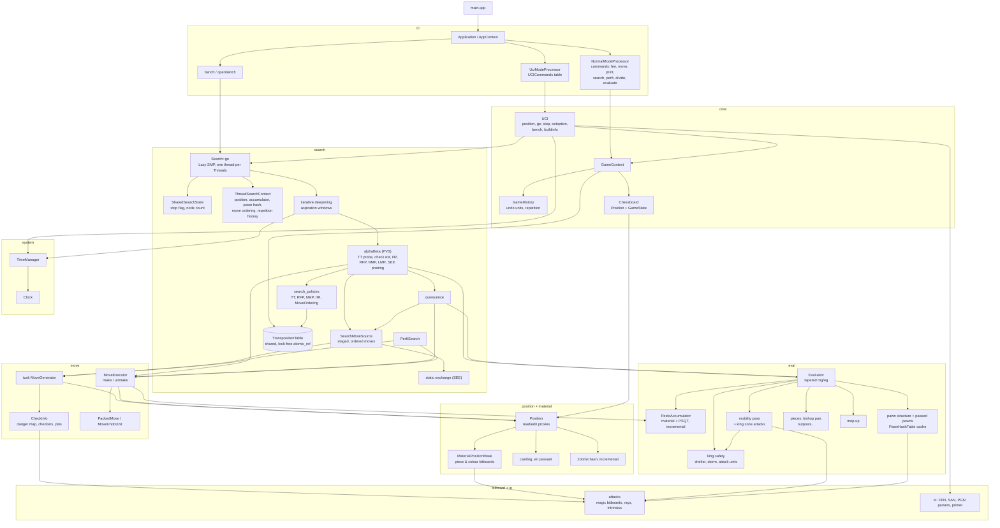

```mermaid
flowchart TD
    main["main.cpp"]

    subgraph cli["cli"]
        app["Application / AppContext"]
        normal["NormalModeProcessor<br/>commands: fen, move, print,<br/>search, perft, divide, evaluate"]
        ucimode["UciModeProcessor<br/>UCICommands table"]
        bench["bench / openbench"]
    end

    subgraph core["core"]
        uci["UCI<br/>position, go, stop, setoption,<br/>bench, buildinfo"]
        game["GameContext"]
        history["GameHistory<br/>undo units, repetition"]
        board["Chessboard<br/>Position + GameState"]
    end

    subgraph search["search"]
        go["Search::go<br/>Lazy SMP, one thread per Threads"]
        shared["SharedSearchState<br/>stop flag, node count"]
        ctx["ThreadSearchContext<br/>position, accumulator, pawn hash,<br/>move ordering, repetition history"]
        id["iterative deepening<br/>aspiration windows"]
        ab["alphaBeta (PVS)<br/>TT probe, check ext, IIR,<br/>RFP, NMP, LMR, SEE pruning"]
        qs["quiescence"]
        policies["search_policies<br/>TT, RFP, NMP, IIR, MoveOrdering"]
        source["SearchMoveSource<br/>staged, ordered moves"]
        see["static exchange (SEE)"]
        tt[("TranspositionTable<br/>shared, lock-free atomic_ref")]
        perft["PerftSearch"]
    end

    subgraph system["system"]
        time["TimeManager"]
        clock["Clock"]
    end

    subgraph move["move"]
        gen["tusk MoveGenerator"]
        check["CheckInfo<br/>danger map, checkers, pins"]
        exec["MoveExecutor<br/>make / unmake"]
        packed["PackedMove / MoveUndoUnit"]
    end

    subgraph position["position + material"]
        pos["Position<br/>read/edit proxies"]
        mat["MaterialPositionMask<br/>piece & colour bitboards"]
        state["castling, en passant"]
        hash["Zobrist hash, incremental"]
    end

    subgraph eval["eval"]
        evaluator["Evaluator<br/>tapered mg/eg"]
        pesto["PestoAccumulator<br/>material + PSQT, incremental"]
        pawns["pawn structure + passed pawns<br/>PawnHashTable cache"]
        mob["mobility pass<br/>+ king zone attacks"]
        king["king safety<br/>shelter, storm, attack units"]
        pieces["pieces: bishop pair,<br/>outposts..."]
        mopup["mop-up"]
    end

    subgraph base["bitboard + io"]
        attacks["attacks<br/>magic bitboards, rays, intrinsics"]
        io["io: FEN, SAN, PGN parsers, printer"]
    end

    main --> app
    app --> normal
    app --> ucimode
    app --> bench
    ucimode --> uci
    normal --> game
    bench --> go
    uci --> game
    uci --> go
    uci --> time
    uci --> io
    game --> board
    game --> history
    game --> tt
    board --> pos

    go --> shared
    go --> ctx
    go --> id
    time --> clock
    id --> time
    id --> ab
    ab --> qs
    ab --> policies
    policies --> tt
    ab --> source
    qs --> source
    source --> see
    source --> gen
    ab --> exec
    qs --> exec
    ab --> evaluator
    qs --> evaluator
    perft --> gen
    perft --> exec

    gen --> check
    gen --> pos
    check --> attacks
    exec --> pos
    exec --> pesto
    exec --> packed

    pos --> mat
    pos --> state
    pos --> hash
    mat --> attacks

    evaluator --> pesto
    evaluator --> pawns
    evaluator --> mob
    evaluator --> king
    evaluator --> pieces
    evaluator --> mopup
    mob --> king
    mob --> attacks
    pawns --> attacks
```