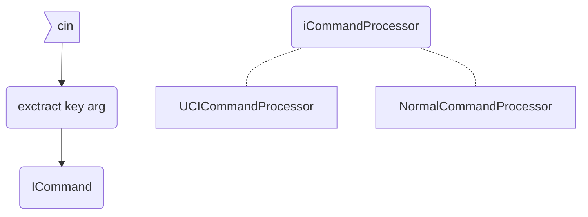

```mermaid
graph TB
    _cin>cin] --> argExt(exctract key arg)
    
    iCmdP(iCommandProcessor) 
    uci[UCICommandProcessor]
    ply[NormalCommandProcessor]
    icmd(ICommand)

    iCmdP -.- uci
    iCmdP -.- ply

    argExt --> icmd


```